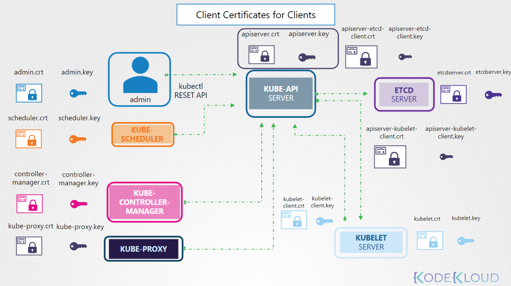
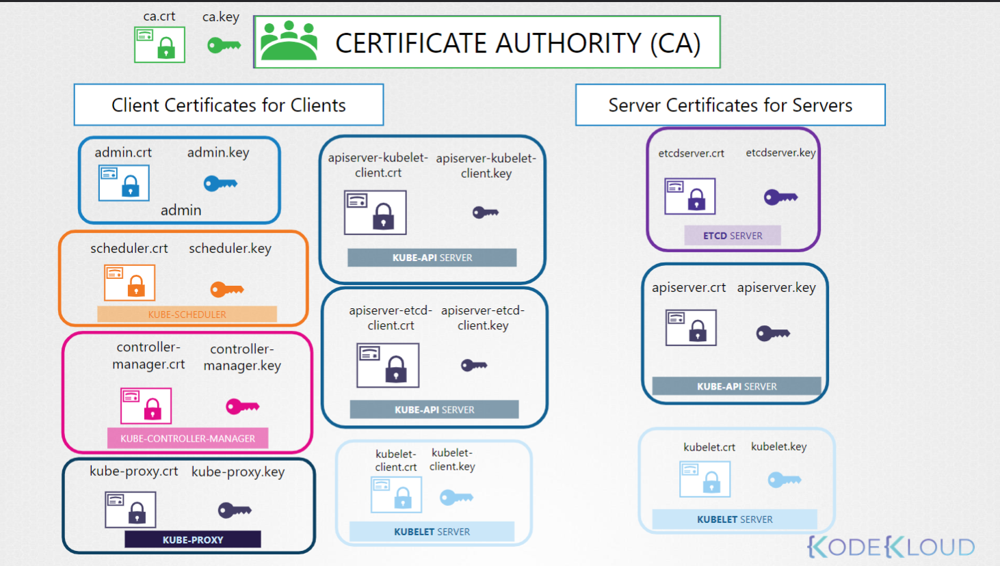

# TLS Certificates for Cluster Components

## Goals

- What are TLS Certificates
- How does Kubernetes use Certificates
- How to generate them
- How to configure them
- How to view them
- How to troubleshoot issues related to Certificates

## Prerequisites

### Symmetric Encryption

Symmetric key encryption uses the same key to encrypt and decrypt data.  
The problem with this is how to get the key to the other server without it being stolen.

### Asymmetric Encryption

Asymmetric encryption uses a Private Key and a Public Key.  
The public key is used to encrypt data but cannot decrypt it.
Private keys are given to anyone that needs to encrypt data, so they are typically stored on the target server you want to log into.

Generate a key pair with `ssh-keygen`  This will create a private key called `id_rsa` and a public key `id_rsa.pub` which are usually stored in the users `~/.ssh` folder.

The Public key can then be copied to the target server.  Public keys go in the `~/.ssh/authorized_keys` file.

### Generating a Private and Public Key Pair With OpenSSL

```bash
# Generate the private key
openssl genrsa -out my-bank.key 1024
# Use the private key to generate a public key
openssl rsa -in my-bank.key -pubout > mybank.pem
```

**Workflow**

1. When the user first accesses a server, he gets the public key from the server
2. The users browser then encrypts the symmetric key using the servers public key.
3. The browser then sends this encrypted key to the server
4. The server uses its private key to decrypt the symmetric key.
5. The symmetric key is now safely available to only the user and the server, they can now talk securely.

### Certificates

Certificates are used to authenticate that the server is who they say they are.  
The certificate contains the URLs and dates it is valid for.  
Certificates are signed by a trusted Certificate Authority (CA) Like Symantec, GlobalSign, DiciCert, etc.  
If the certificate is self signed, your browser will not trust it.

### Creating a Certificate Request

Create a certificate request using openssl

`openssl req -new -key my-bank.key -out my-bank.csr -subj "/C=US/ST=CA/O=MyOrg, Ince/CN=mydomain.com`

Send the my-bank.csr to the CA for signing.  
The CA verifies your details, i.e. do you own that domain, etc.  
They then sign the CA and send it back.  You now have a certificate signed by a CA that the browsers will trust.

**Warning** 

Technically, either key can encrypt data but the other key must decrypt it so care must be taken that you encrypt with the correct key.  
Only ever encrypt data with the **public** key, never with the private.  If you encrypt data with the private key then anyone with your public key can decrypt it.

### Naming

A Certificate (public key) has an extension of .crt or .pem  
Example: server.crt or server.pem and client.crt or client.pem

A Private Key has an extension of .key or -key.pem  
Example: server.key or server-key.pem and client.key or client-key.perm
Private keys should always have key in them, either as the extension or part of the name, if key is not there it is probably a public key.

## List of Certificates

### Servers

| Service | Public Key | Private Key
|------------|------------|---------|
| cluster CA | ca.crt | ca.key |
| kube-api server | apiserver.crt | apiserver.key |
| etcd server | etcdserver.crt | etcdserver.key |
| Kubelet server | kubelet.crt | kublet.key |

### Clients

All of these talk to the Kube-API

| Client | Public Key | Private Key
|------------|------------|---------|
| admin | admin.crt | admin.key |
| kube-scheduler | scheduler.crt | scheduler.key |
| kube-controller-manager | controller-manager.cert | controller-manager.key|
| kube-proxy | kube-proxy.crt | kube-proxy.key |

### Optional: 

Optional:  The kube-api server talks to etcd, it can use it's primary certs for communication or you can create custom certificates for that communication.  Same with the kubelet.

| Client | Public Key | Private Key
|------------|------------|---------|
| apiserver to etcd | apiserver-etcd-client.crt | apiserver-etcd-client.key |
| apiserver to kubelet | apiserver-kubelet-client.crt | apiserver-kubelet-client.key |
| kubelet to apiserver | kubelet-client.crt | kubelet-client.key |

   



## Generating Certificates

There are many tools to generate certificates: Easyrsa, openssl, cfssl.  
We will be using `openssl`.

### CA Key

```bash
# Generate the key
openssl genrsa -out ca.key 2048
# output is ca.key

# Create certificate signing request
openssl req -new -key ca.key -subj \
  "/CN=KUBERNETES-CA" -out ca.csr
# output is ca.csr

# Sign Certificate using the key we generated in step 1 which is our Certificate Authority key.
openssl x509 -req -in ca.csr -signkey ca.key -out ca.crt
# output is ca.crt
```

### Admin User

```bash
# Generate the key
openssl genrsa -out admin.key 2048
# output is admin.key

# Create certificate signing request
openssl req -new -key admin.key -subj \
  "/CN=kube-admin/O=system:masters" -out admin.csr
# output is admin.csr
# MUST mention system:masters group in test

# Sign Certificate.  This command is slightly different as it uses the ca.crt AND the ca.key
openssl x509 -req -in admin.csr –CA ca.crt -CAkey ca.key -out admin.crt
# output is admin.crt
```

### Kube Scheduler and Other Clients

The kube-scheduler is a system component which is part of the control-plane so it's name must be prefixed with the keyword `system`

```bash
# Generate the key
openssl genrsa -out scheduler.key 2048
# output is admin.key

# Create certificate signing request
openssl req -new -key scheduler.key -subj \
  "/CN=system:kube-scheduler" -out scheduler.csr
# output is scheduler.csr

# Sign Certificate
openssl x509 -req -in scheduler.csr –CA ca.crt -CAkey ca.key -out scheduler.crt
# output is scheduler.crt
```

Repeat for kube-controller-manager and kube-proxy

### etcd

We will generate a key pair for each etcd server in the cluster (if there are more than 1)

```bash
# Generate the key
openssl genrsa -out etcdserver.key 2048
# output is etcdserver.key

# Create certificate signing request
openssl req -new -key etcdserver.key -subj \
  "/CN=etcd-server" -out etcdserver.csr
# output is etcdserver.csr

# Sign Certificate
openssl x509 -req -in etcdserver.csr –CA ca.crt -CAkey ca.key -out etcdserver.crt
# output is etcdserver.crt
```
If more than one server names should be etcdserver1.key, etc.

### kube-api server

The kube-api server goes by a lot of names so they must be in the cert request.  

- kube-api
- kubernetes
- kubernetes.default
- kubernetes.default.svc
- kubernetes.default.svc.cluster.local
- And ip of the server or pod running it

We need an openssl.conf file to support all of the alternate names.

openssl.conf
```conf
openssl.cnf
[req]
req_extensions = v3_req
[ v3_req ]
basicConstraints = CA:FALSE
keyUsage = nonRepudiation, 
subjectAltName = @alt_names
[alt_names]
DNS.1 = kubernetes
DNS.2 = kubernetes.default
DNS.3 = kubernetes.default.svc
DNS.4 = kubernetes.default.svc.cluster.local
IP.1 = 10.96.0.1
IP.2 = 172.17.0.87
openssl req -new -key apiserver.key -subj \
"/CN=kube-apiserver" -out apiserver.csr –config openssl.cnf
```

Then create the request as normal but pass `openssl.conf` into the signing request via `-config`

```bash
# Generate the key
openssl genrsa -out apiserver.key 2048
# output is apiserver.key

# Create certificate signing request
openssl req -new -key apiserver.key -subj \
  "/CN=kube-apiserver" -out apiserver.csr –config openssl.cnf
# output is apiserver.csr

# Sign Certificate
openssl x509 -req -in apiserver.csr –CA ca.crt -CAkey ca.key -out apiserver.crt
# output is apiserver.crt
```

### kubelet Server Certs

We need to generate one set of certificates for the kubelet on each node.  
The name will be the name of the node.  Example `/CN=node01`

### Kubelet Client Certs

Same as above but the name must be like: `/CN=system:node:node01` and they must be added to the group `system:nodes` with `/O=system:nodes`

## Viewing Certificates

This depends on how the cluster was set up.  "The hard way" (by hand), with kubeadm or some other tool.  

For kubeadm look in `/etc/kubernetes/manifests/kube-apiserver.yaml`, it will say where the certs are.
Then use openssl to look at the certs.  For example the apiserver TLS cert would be.  
`openssl x509 -in /etc/kubernetes/pki/apiserver.crt -text -noout`

Check the following

- Its name under Subject: It should be kube-apiserver
- Its alternate names under X509v3 Subject Alternate Name:  There should be a bunch roughly matching our openssl.conf from above.
- Check the validity to make sure it is not expired
- Check the Issuer, should probably be CN=kubernetes

Check the excel spreadsheet included in this folder for others

### Check Logs

Check the service logs if the component was set up as a service.  
Example: `journalctl -u etcd.service -l`

If set up with kubeadm then check the container logs:  
`k logs etcd-master`

If the kube-api server is down, then use docker

### Memorize This

kubeadm stores certs in `/etc/kubernetes/pki`

```bash
openssl x509 -noout -text -in /etc/kubernetes/pki/apiserver.crt
```

## Certificate Workflow and API

When using certificates for cluster access a new user would generate a certificate signing request and send that to the Administrator.   
```bash
openssl genrsa -out jane.key 2048
openssl req -new -key jane.key -subj "/CN=jane" -out jane.csr
```

The admin can then log on the CA Server (that server that has the CA cert and key on it which is often the master) and uses Open SSL to sign the request.   

The admin can also use the Kubernetes API to sign the request and view past and present requests.

```yaml
apiVersion: certificates.k8s.io/v1
kind: CertificateSigningRequest
metadata:
  name: akshay
spec:
  signerName: kubernetes.io/kube-apiserver-client
  expirationSeconds: 86400  # one day
  usages:
  - client auth
  request: LS0tLS1C<redacted>tLQo=
```
There are two sets of commands to work with Certificates and Certificate Signing Requests:  
```bash
k <verb> csr
k get csr
k delete
# and
k certificate approve <csr-name>
k certificate deny <csr-name>
```

Requests can be seen by administrators: `k get csr`  
Approve the request: `k certificate approve jane`  
View the certificate: `k get csr jane -o yaml` copy base64 data from `status/certificate`  
OR  
`k get csr june -o jsonpath='{.status.certificate}'| base64 -d > june0.crt`

The controller managers does the CSR work.

## KubeConfig

```bash
k config view # view the current config file
k config use-context <context-name> # Switch contexts
```  

```yaml
apiVersion: v1
kind: Config
clusters:
- name: production
  cluster:
    certificate-authority: /etc/kubernetes/pki/ca.crt
    server: https://172.17.0.51:6443
contexts:
- name: admin@production
  context:
    cluster: production
    user: admin
users:
- name: admin
  user:
    client-certificate: /etc/kubernetes/pki/users/admin.crt
    client-key: /etc/kubernetes/pki/users/admin.key
```

View the [Kubernetes View Checker](https://github.com/mmumshad/kubernetes-the-hard-way/tree/master/tools) spreadsheet here.